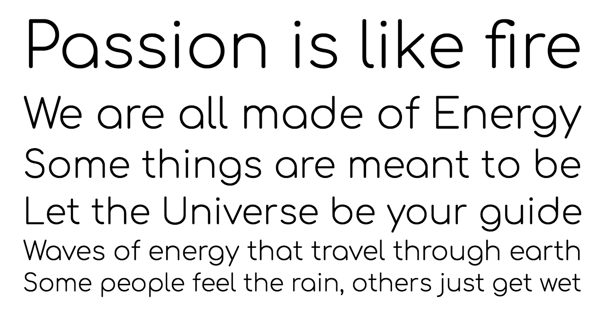
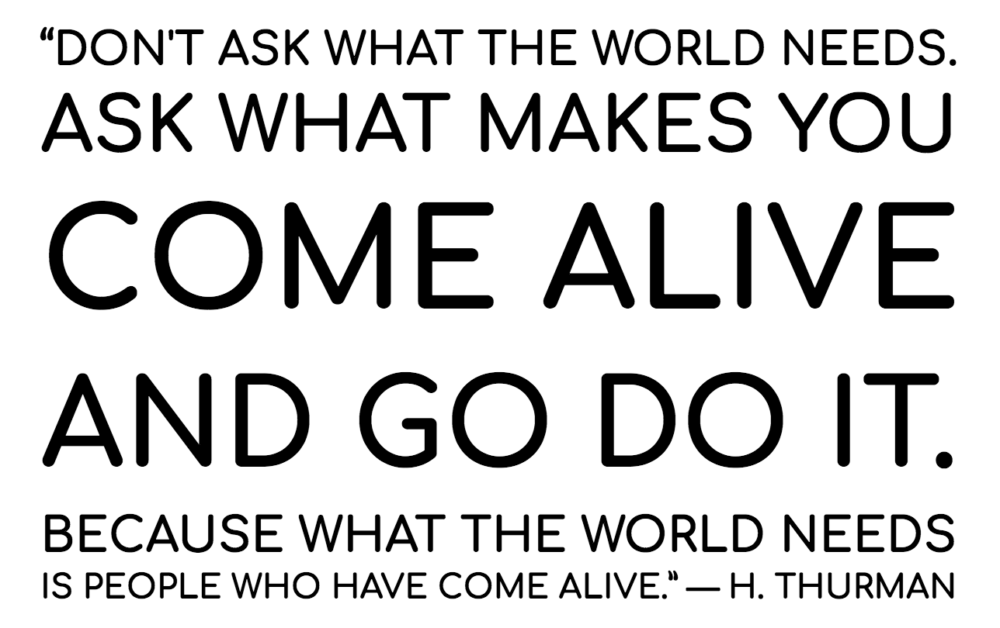

# Comfortaa

Comfortaa is a rounded geometric sans-serif type design intended for large sizes. It is absolutely free, both for personal and commercial use.

If you like it please visit my DeviantArt page and fav it (but obviously only if you like it.) You are also more than welcome to comment about anything you want (I'm open to critique). I obviously would love to see how my font is being used, so feel free to comment with a link to your work, or send me a message.

I hope you will enjoy using my font!

*— Johan Aakerlund*

### Donate

[Paypal donation page](https://www.paypal.com/dk/cgi-bin/webscr?cmd=_flow&SESSION=2VE9sFtyVTcbp-E0fO9DJfr7kwAKvgJuMDIWg2-DMgqbQHjWMnBTBTdFY48&dispatch=5885d80a13c0db1f8e263663d3faee8d4fe1dd75ca3bd4f11d72275b28239088)

### Recent changes v.3.000 (@alexeiva)

* Overall design and spacing improvements
* Expantion to GF Latin Plus, GF Cyrillic Plus

### License

This Font Software is licensed under the SIL Open Font License, Version 1.1.
This license is copied below, and is also available with a FAQ at:
http://scripts.sil.org/OFL

### Copyright

Copyright (c) 2010, Johan Aakerlund (aajohan@gmail.com),
with Reserved Font Name "Comfortaa".

